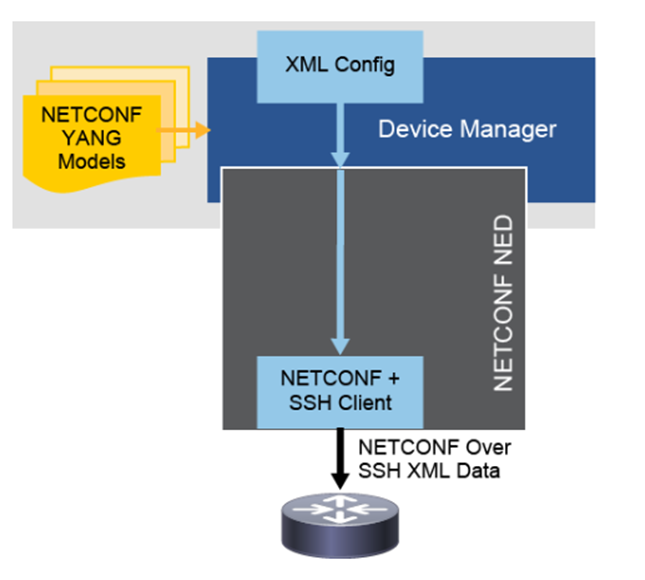

---
layout:
  width: default
  title:
    visible: true
  description:
    visible: true
  tableOfContents:
    visible: true
  outline:
    visible: true
  pagination:
    visible: true
  metadata:
    visible: true
  tags:
    visible: true
---

# Cisco NSO

### Cisco Network Services Orchestrator (NSO)

Primarily, **Cisco Network Services Orchestrator (NSO)** is a multivendor service orchestration platform that enables end-to-end service orchestration across physical or virtual devices. Cisco NSO can also be perceived as a multivendor service-layer SDN controller for data centers or service providers. It provides a single application programming interface (API), and a single user interface to the network.

NETCONF is a preferred device management protocol.

YANG is used for service and device modeling.

This means that network devices can be managed in a standardized way, regardless of vendor or hardware differences. Service management systems don’t need to worry about device-specific configurations; they just interact with YANG models

Provide northbound service management application programming interfaces (APIs).

Reliable network configuration management is achieved through networkwide transactions.

Provide southbound management interfaces for non-NETCONF elements.

The **FASTMAP algorithm** further simplifies service design and also ensures optimal and reliable configuration management.

FASTMAP enables automatic management of service instances. Any change to a particular service instance has to comply to its corresponding service definition. Mapping of service instance to the corresponding device configuration that is used in the service create process is defined either through high-level API or a configuration template. The programmer can define custom service create process in corresponding Java or Python method. If later on, a user decides to change or delete an existing service instance, Cisco NSO calculates the changes and applies them automatically.

At any point in time a user or external client can modify a service and Cisco NSO will automatically calculate the required minimum difference that is needed for reflecting that change on the network. Also, deleting a service instance from the network will automatically clean up all configuration data on all devices that are mapped to that service.

**Service dry-run:** Cisco NSO calculates what would happen if the service is committed towards the network.

**Service check-sync:** Is the service configuration in sync with the actual device configuration? This action can detect cases where a network engineer tampers with service configuration on the Cisco NSO or directly on a network device.

**Service re-deploy:** Cisco NSO generates the minimum amount of device configuration that is needed to restore a service on the network.

**FASTMAP southbound operations** are

**create** – Used to create new configurations on the network devices.

**update** – Modifies existing configurations on the devices.

**delete** – Removes configurations from the devices.

### Logical architecture

The logical architecture outlines the Cisco NSO two-layered approach. A device manager that simplifies device interface integration and manages device configuration scenarios, and a service manager that applies service changes to devices. At the core of Cisco NSO is the configuration data store, Configuration Database (CDB), which is in sync with the actual device and service configuration. It also manages relationships between services and devices, and can handle revisions of device interfaces.

>)

Service Layer (Specification Layer)

Acts as an interface for operators and applications, hiding network complexities.

Uses model-to-model mapping to translate high-level services into device-specific configurations.

Transactional, meaning changes are applied fully or not at all, avoiding partial failures and simplifying error handling.

Network Operating System (NOS) Layer

Provides a device-level interface for management.

Transactional, ensuring smooth error recovery and activation processes.

The power of Cisco NSO lies in its model-to-model mapping principles. It is able to describe complex services at the service layer and map those services to device models, which represent various devices from various vendors. This way, complex services can be described and implemented in simple ways and pushed to the devices without any concern about device vendor, configuration semantics, configuration interfaces, and so on

Forwarding Layer

Controls devices via OpenFlow, Cisco CLI, SNMP, NETCONF, etc.

Real-world networks use a mix of traditional and OpenFlow devices.

Supports multiple protocols, ensuring compatibility across different network devices.

Device behaviors are standardized using data models.

Which channel does Cisco NSO use for communication with the forwarding layer?

Network Element Drivers (NEDs) for southbound communication.

Northbound APIs are exposing the NSO services. NEDs are not used for northbound communication. SNMP and CLI can be part of the NED. Southbound APIs are not part of NSO concept.

>)

### Core engine

**Core engine** handles fundamental functions like transactions, high-availability replication, upgrades and downgrades, and other crucial operational functions

The transaction manager handles nested transactions between services and devices, and is capable of rolling back service configurations across multiple devices.

All NSO operations pass through a centralized authentication, authorization, and accounting (AAA) engine that handles authentication and session management.

Role-based access control can be defined at any granularity level.

When high availability is enabled in ncs.conf, the configuration database (CDB) automatically replicates data that is written on the primary node to the connected subordinate nodes. Replication occurs on a per-transaction basis to all the subordinates in parallel. It can be configured to occur asynchronously (best performance) or synchronously in step with the transaction (most secure).

All activities are logged in an audit log.

Cisco NSO runs its own internal semantic and syntactic validation against the model constraints.

Cisco NSO provides transaction rollback and saves configuration rollbacks in separate files.

Core engine also handles upgrades and downgrades.

All other configuration and operational data is handled in the main CDB.

### Configuration Database (CDB)

Cisco NSO uses **Configuration Database (CDB)** to store its own configuration, the configuration of all services, copies of the configuration of all managed devices, and all NSO-specific operational data. CDB is a RAM database, the entire configuration is kept in RAM always. Thus, if you use Cisco NSO to manage a large network, you need a lot of RAM memory. Persistence of the CDB occurs in a way that every transaction, per successful execution, is written to the disk drive of the server. CDB is hierarchical with a tree-like structure.

While it is possible to integrate and run Cisco NSO with databases other than CDB, the trade-offs might not be worthwhile. There are many advantages to CDB, compared to using some external storage for configuration data. CDB has:

A solid model on how to handle configuration data in network devices, including a good update subscription mechanism.

A networked API whereby it is possible for a nonconfigured device to find the configuration data on the network and use that configuration.

Fast and lightweight database access. By default, CDB keeps and operates the entire configuration in RAM. Disk is used for persistence purposes.

CDB is easy to use, is already integrated into Cisco NSO, and the database is lightweight and has no maintenance needs. Writing instrumentation functions for accessing data are easy.

Automatic support for upgrade and downgrade of configuration data

>)

### Service manager

With the **service manager**, you can develop service-aware applications, such as IPTV or Multiprotocol Label Switching (MPLS) VPNs that configure devices. In this case, the data models for the services are not defined by the devices but are the result of a modeling activity. Apart from the YANG modeling activity to define the model, the model must be mapped into the corresponding device operations. Usually, you map the models by specifying configuration templates that transform service parameters to device configuration parameters. You can also perform this task by programmatically "mapping logic" for more complex cases. Both approaches use Cisco NSO FASTMAP to simplify the mapping and to handle the complete lifecycle, for example, by updating and deleting service instances.

Service manager provides these functions:

Service modeling using YANG

Mapping to device models, using templates (XML), and/or Java or Python code

Service activation

Service modification

Service decommissioning

Service restoration

Service synchronization with device configurations

Service testing

Aggregated operational data

Validation of service configuration.

Transaction-safe activation of services across various devices

mapping logic:

Transforms the service models to device models

When templates are not enough:

External callouts can be made

Expressions or algorithms in Java or Python code can be used

Uses FASTMAP

Additional code required for a complex service

>)

### Device manager

The purpose of the **device manager** is to manage various devices using a clean YANG and NETCONF view. Irrespective of an underlying interface such as SNMP or CLI, the device manager will provide a transactional view toward devices. Users or programmers can then configure the devices and read operational data from the devices in a unified way. When a device supports YANG and NETCONF natively, the device manager is totally automatic. Non-NETCONF devices are integrated using the NED toolkit.

Quickly provision a new device by copy-and-edit either from the configuration of another device or from a template configuration.

Deploy configuration changes to multiple devices in a fail-safe way, using distributed transactions.

Validate the integrity of configurations before deploying to the network.

Apply configuration changes to named device groups.

Apply templates (with variables) to named device groups.

Easily roll back changes, if necessary.

Configuration audits: Check whether device configurations are in sync with the Cisco NSO database. If the result is false, the difference can be outputted.

Synchronize the Cisco NSO database and the configurations on devices, in case they are not in sync. You can do this in either direction by either importing the difference to the Cisco NSO database or deploying the difference on devices.

Automatic and code-free integration to NETCONF (such as Juniper), Cisco CLI, and SNMP devices. Limited amount of code to other proprietary interfaces.

### Templates

**Templates** are a flexible and powerful mechanism that simplifies how changes can be made across the configuration data, and also allows a declarative way to describe such manipulations. Templates can be applied in a traditional "fire-and-forget" fashion by using them in actions or when Cisco NSO FASTMAP uses them as part of a service implementation. When a template is used as part of a service implementation, Cisco NSO stores the configuration changes made toward the devices for possible later modification.

Two types:

Device templates: For direct activation, for example, through Cisco NSO CLI or REST

Configuration templates: For service mapping to device configurations

### Package manager

**Package manager:** A **package** is basically a directory of files with a fixed file structure. The package manager takes care of package lifecycle. Packages are extending Cisco NSO built-in functionalities.

A package consists of code, YANG modules, and custom WebUI widgets, and so on, that are necessary for adding an application or function to Cisco NSO. Packages are a controlled way to manage the loading and running of custom applications

Cisco NSO packages contain data models and code for a specific function. It might be a NED for a specific device, a service application like MPLS VPN, a WebUI customization package, and so on. Packages can be added, removed, and upgraded in run-time.

A package for a specific function contains:

Data models (YANG)

Code (Java/Python)

A package might be:

NED for a specific device

Service application like MPLS VPN

WebUI customization

YANG Model (Defines config schema) → ./mypkg/src/yang/mypkg.yang

Templates (Map service data to device config) → ./mypkg/templates/mypkg.xml

Code (Python/Java) (Extends functionality) → ./mypkg/python/mypkg/main.py

package-meta-data.xml (Defines package components to load)

#### Package management

Listed here are the main steps in the creation process for a new package:

Create a package skeleton using the ncs-make-packages tool, which simplifies initial package creation by creating a skeleton directory and file structure.

Develop the package by using a text editor or the appropriate Integrated Development Environment (IDE) to develop the package by modifying and creating the necessary files (YANG, Java, Python, XML templates)

When done, compile the package by issuing the make command in the src subdirectory.

Includes syntax and semantic verification of package definitions

Reads the makefile to determine the components to compile

Activate the package by issuing the packages reload command in Cisco NSO CLI:

Activates new packages or upgrades existing packages.

Reads the package-meta-data.xml file to determine which components to load.

### Alarm manager

An **alarm** is an undesirable state in a resource for which an operator action is required.

Cisco NSO embeds a generic alarm manager. It is used for managing Cisco NSO native alarms and can easily be extended with application-specific alarms. Alarm sources can be notifications from devices, detected undesired states on services, or anything provided via the APIs.

Cisco NSO contains other mechanisms for logging in general. Therefore, Cisco NSO does not naively populate the alarm list with traps that are received in the SNMP notification receiver. State and model-based (service to device model) correlation of alarms rather than notification-based

It has states (e.g., active, cleared) and is linked to resources (e.g., device, time, severity).

Operators manage alarms based on user-defined rules for logging and resolution.

Cisco NSO does not automatically clear alarms—network conditions must trigger clearance

### Cisco NSO interfaces (CLI/WebUI)

Cisco NSO CLI:

Access the Cisco NSO CLI via SSH on port 2024 (default)

Two modes (use the config and exit commands to switch between them):

Operational

Configuration

Two CLI styles (use the switch cli command to switch between them):

Cisco

Juniper

Autocompletion using tab or space characters

Question mark for syntax help and command description

NSO WebUI via HTTP on port 8080 (default)

The NSO WebUI has two modes of operation:

Configuration: [http://localhost:8080/webui-one/](http://localhost:8080/webui-one/)

Legacy: [http://localhost:8080/prime/](http://localhost:8080/prime/)

The ncs.conf file contains the configuration with default management ports.

### Network Element Drivers (NEDs)

**Network Element Drivers (NEDs)** are the components that device manager uses as an interface to manage the devices. NEDs provide the connectivity between Cisco NSO and the devices. NEDs are installed as Cisco NSO packages.

For NETCONF and SNMP devices there is no code. For CLI devices there is a minimum of code managing connecting over SSH/Telnet and looking for version strings. The rest is auto-rendered from the data-model. Independent of underlying device interface technology NEDs come with a data-model in YANG that specifies configuration data and operational data that is supported for the device.

>)

#### NETCONF NED

Having a NETCONF agent running on a device enables the Cisco NSO to communicate directly with the device. No coding is required to support device configuration. Some, but not all vendor support this capability.

Cisco NSO knows how to automatically communicate southbound to NETCONF and SNMP enabled devices. By supplying Cisco NSO with the YANG models of a NETCONF device, Cisco NSO knows the data models of the device, and through the NETCONF protocol knows exactly how to manipulate the device configuration. This can be used for a NETCONF capable device, any device that uses ConfD as management system, or any other device that runs a compliant NETCONF server. Similarly, by providing Cisco NSO with the MIBs for a device, Cisco NSO can automatically manage such a device using SNMP.

Cisco NSO uses XML data internally (NETCONF)

Native NED for Cisco NSO

No coding required

NETCONF NED YANG

YANG model: Defines device XML config

Only YANG device model required

Can be used with any device supporting NETCONF

<figure><figcaption></figcaption></figure>

#### CLI NED

is an entirely model driven way to CLI script towards all Cisco like devices. The basic idea is that the Cisco CLI engine found in ConfD, which is part of the Cisco NSO in this case, can be run in both directions:

A sequence of Cisco CLI commands can be turned into the equivalent manipulation of the internal XML tree that represents the configuration inside Network Control System (NCS)/ConfD. This is the normal mode of operations of ConfD, run in Cisco mode. A YANG model, annotated appropriately, will produce a Cisco CLI. The user can enter Cisco commands and ConfD will, using the annotated YANG model, parse the Cisco CLI commands and change the internal XML tree accordingly. Thus, this is the CLI parser and interpreter. ConfD is model driven.

The reverse operation is also possible. Given two different XML trees, each representing a configuration state, in the ConfD case it represents the configuration of a single device, that is, the device using ConfD as management framework, whereas in Cisco NSO's case, it represents the entire network configuration, you can generate the list of Cisco commands that would take you from one XML tree to another. This technology is used by Cisco NSO to generate CLI commands southbound when we manage Cisco like devices.

NSO uses XML data internally (NETCONF)

CLI NED YANG

YANG model: Defines device XML config

YANG extensions: Define device CLI config

Java code

For NED logic

For SSH

ConfD converts between XML and CLI (bidirectional)

>)

#### SNMP NED

Cisco NSO can configure a managed device using SNMP in certain cases, but SNMP is generally unsuitable for configuration due to several limitations. The SNMP SET request is restricted to a single UDP packet, requiring large changes to be split into multiple requests, making rollback difficult if one fails. SNMP’s data model (SMIv2) does not differentiate between configuration and other writable objects, meaning retrieving only configuration data requires explicit knowledge of all MIBs. Additionally, SNMP only supports basic read and write operations, lacking built-in mechanisms for creating or deleting data. Semantic constraints are also limited, making it hard to ensure a configuration will apply cleanly.

Despite these challenges, Cisco NSO can configure devices over SNMP if the MIBs are properly annotated to guide NSO in handling configuration data correctly.

>)

To add a device, the following steps need to be followed. They are described in more details in the following sections.

Collect (a subset of) the MIBs supported by the device.

Optionally annotate the MIBs with annotations to instruct Cisco NSO on how to talk to the device, for example ordering dependencies that are not explicitly modeled in the MIB. This step is not required.

Compile the MIBs and load them into Cisco NSO.

Configure Cisco NSO with the address and authentication parameter for the SNMP devices.

Optionally configure a named MIB group in Cisco NSO with the MIBs supported by the device, and configure the managed device in Cisco NSO to use this MIB group. If this step is not done, Cisco NSO assumes that the device implements all MIBs known to Cisco NSO.

See the makefile: snmp-ned/basic/packages/ex-snmp-ned/src/Makefile, for an example of the below description. Make sure that you have all MIBs available, including import dependencies and that they contain no errors.

Compiling and Loading MIBs

The ncsc --ncs-compile-mib-bundle compiler is used to compile MIBs and MIB annotation files into Cisco NSO load files. Assuming a directory with input MIB files (and optional MIB annotation files) exist, the following command compiles all the MIBs in device-models and writes the output to ncs-device-model-dir.

$ ncsc --ncs-compile-mib-bundle device-models --ncs-device-dir ./ncs-device-model-dir

The compilation steps performed by the ncsc --ncs-compile-mib-bundle are elaborated below:

Transform the MIBs into YANG according to the IETF standardized mapping ( [http://www.ietf.org/rfc/rfc6643.txt](http://www.ietf.org/rfc/rfc6643.txt)). The IETF defined mapping makes all MIB objects read-only over NETCONF.

Generate YANG deviations from the MIB, this basically makes SMIv2 read/write objects YANG config true as a YANG deviation.

Include the optional MIB annotations.

Merge the read-only YANG from step 1 with the read/write deviation from step 2.

Compile the merged YANG files into Cisco NSO load format.

This list summarizes the key features of SNMP NED:

Cisco NSO uses XML data internally (NETCONF)

SNMP NED YANG

MIBs: Translated to YANG

YANG model: Defines device XML config

ConfD converts between XML and SNMP (bidirectional)

#### Generic NED

is used in Cisco NSO to manage devices that do not support NETCONF, SNMP, or CLI modeling. This includes devices that rely on proprietary CLIs or protocols like REST, CORBA, XML-RPC, or SOAP. Similar to a CLI NED, a Generic NED must connect to the device, retrieve capabilities, apply changes, and sync the configuration.

Instead of sending CLI commands, a Generic NED receives a set of NedEditOp objects, each representing an operation like create, delete, or update, along with a keypath and optional value. Syncing configuration requires fetching the full device config and writing it into a transaction using the Maapi interface.

Once implemented, a Generic NED allows Cisco NSO to perform network-wide transactions just like NETCONF and CLI NEDs. However, rollback is challenging for devices that don’t support transactions, requiring reverse diff calculations to undo changes. Authentication also depends on the device protocol, sometimes requiring custom authentication methods.

NSO uses XML data internally (NETCONF)

Generic NED YANG

YANG model: Defines device XML config

Java code

For protocol implementation

ConfD converts between XML and DOM (bidirectional)

>)

### Network Management Interface Simulator (ncs-netsim)

The **Network Management Interface Simulator (ncs-netsim)** program is a useful tool to simulate a network of devices to be managed by Cisco NSO. It makes it easy to test Cisco NSO packages towards simulated devices. All that you need is the Cisco NSO NED packages for the devices that you need to simulate. The devices are simulated with the Tail-f ConfD product. Every Cisco NSO instance comes with netsim simulation tool installed. Netsim is capable to simulate only the device management interfaces, Cisco NSO is managing a device as if it were real.

Optional add-on to NEDs

Simulates device's native CLI

Useful for development and testing

Lightweight: Enables simulation of many devices on a desktop

Uses YANG model of NSO NED and ConfD in reverse to simulate a device's CLI

| admin$ ncs-netsim --help |   |
| ------------------------ | - |

>)

### NED development process

If there is a need to develop a new NED, the best way to go about is to contact Cisco NSO team. Most likely, the work required will need supervision and support from experienced NED developers.

### NSO ecosystem and ETSI NFV MANO

The figure illustrates the European Telecommunications Standards Institute (ETSI) Management and Orchestration (MANO) architecture that is used to enable an NFV service

The NFV Orchestrator (NFVO) layer where Cisco NSO can be deployed to orchestrate NFV services.

The VNF Manager (VNFM) layer where Cisco ESC can be deployed to control the lifecycle of VNFs. Alternatively, any other 3rd party system can be used to achieve a similar management goal.

The Virtualized Infrastructure Manager (VIM) is used to manage the virtual and optionally also physical infrastructure hosting and interconnecting the VNFs. The figure lists the following examples: OpenStack, VMware, Cisco APIC (for Cisco ACI solutions), Cisco Virtual Topology Controller (VTC) for Cisco Virtual Topology System (VTS) solutions, or any other 3rd party systems.

The last layer consists of the physical and virtual infrastructure that provides the end-functionality for the designed NFV services such as physical and virtual network devices.

>)

>)

The figure illustrates a solution where Cisco NSO is responsible for:

Network Functions Virtualization Infrastructure Software (NFVIS) consisting of several selected VNFs.

Service chains used to link individual components into an end-to-end service.

New branch/physical device registers with day-0 server (Cisco PnP).

Day-0 server provides initial config and registers branch/physical device in Cisco NSO.

Cisco NSO initiates VNF virtual machine creation via Cisco ESC Lite that is part of NFVIS.

Cisco NSO deploys service by configuring physical and virtual devices.

Firewall policies

VLANs

Access control lists ACLs

Port security (802.1X)

Quality of service (QoS)

>)

### Cisco Elastic Service Controller (ESC)

**Cisco Elastic Service Controller (ESC)** is a Virtual Network Functions Manager (VNFM) that performs lifecycle management of VNFs. Cisco ESC provides agentless and multivendor VNF management by provisioning virtual services and monitoring their health. Also, it promotes agility, flexibility, and programmability in NFV environments. It provides the flexibility to define rules for monitoring, and associate actions that are triggered based on the outcome of these rules. Based on the monitoring results, Cisco ESC performs scale-in or scale-out operations on the VNFs. In the event of a VM failure, Cisco ESC also supports automatic VM recovery

Cisco ESC fully integrates with Cisco and other third-party applications. As a standalone product, the Cisco ESC can be deployed as a VNFM. Cisco ESC integrates with Cisco NSO to provide VNF management along with orchestration. Cisco ESC as a VNFM targets the Virtually Managed Services (VMSs) and all service provider NFV deployments, such as virtual video, Wi-Fi, authentication, and so on. Complex services include multiple VMs that are orchestrated as a single service with dependencies between them. These multiple VMs are managed as a single entity, such as VMS 1.0 and later.

Functionalities

VNF lifecycle management

VNF day-0 configuration

VNF license management

VM and service monitoring, recovery, and elasticity

Transaction resume and rollback

Coupled VM VNF management (VM affinity, startup order, manage VM interdependency)
